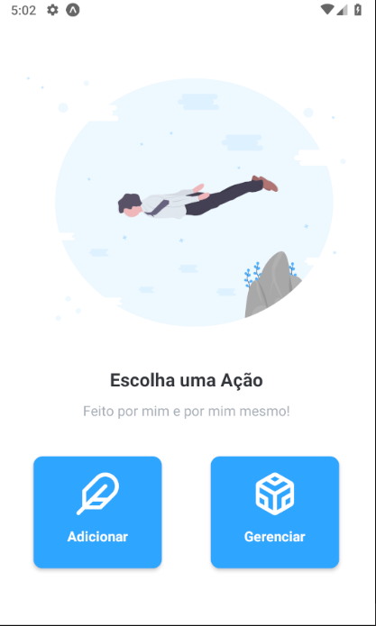
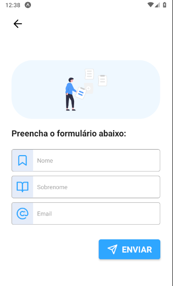
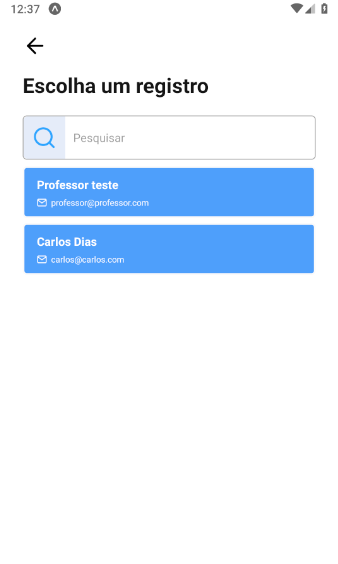
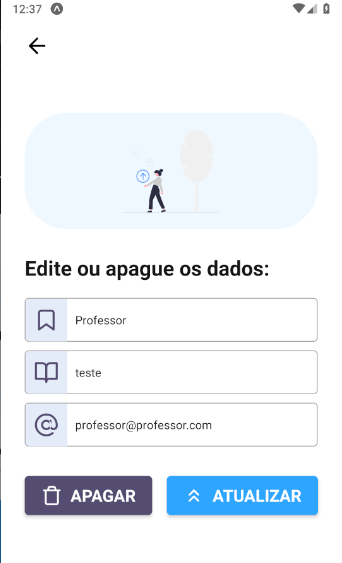

# Teacher CRUD - React Native

## Fiz isso porque estava entendiado e é bom sempre praticar o que se aprende

 

## Imagem das telas do projeto

  
  

 

  
  

 

### Este projeto depende da ativação de uma api em AdonisJS

- Acesse a API por <a href="https://github.com/carloseduardodb/api-crud-teacher">aqui</a>.

 

### Tecnologias Utilizadas

<ul>
<li>
  React Native
</li>

<li>
  Styled Components
</li>

<li>
  Context API
</li>

<li>
  Expo
</li>

</ul>

### Autor

<a href="">
 
  
 <b>Carlos Eduardo</b></a>

Feito com ❤️ por Carlos Eduardo

<a href="mailto:carloseduardodiasbatista@gmail.com">Entre em contato</a>

